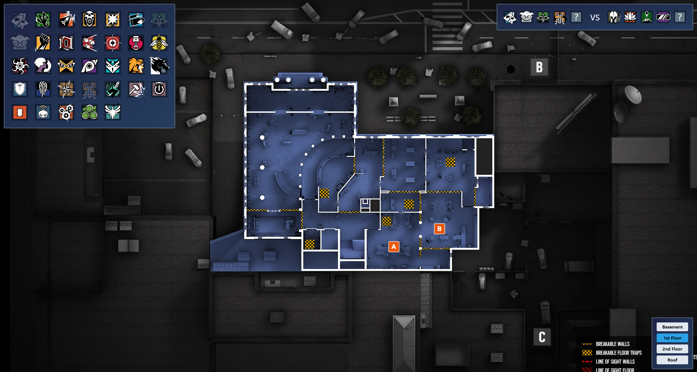

# R6 Picker

A simple tool aiming to help train the thought process behind
picking [Rainbow Six Siege](https://www.ubisoft.com/en-gb/game/rainbow-six/siege) operators (specifically attackers)
based on intel about enemy operators, sites and reinforced walls. For now it's more of an experiment, but it might prove
useful at some point.

## Features

- Supported Operators: **All** except Brava (Y8S1)
- Supported Maps:
    - Bank
    - Bartlett University
- Supported Game Modes:
    - Bomb
    - Hostage
    - Secure Area

## How it works

The app presents the player with the challenge of picking the best operator based on the following, randomly generated
intel:

- Map and objective site
- 4 allied operators
- 2-5 identified enemy operators

The player can take as much time as they want to think through this very important decision - planning their team's
progression through the map - taking possible attack angles, breakable walls and hatches into account.

Eventually, choosing an operator presents the player with the next randomly generated challenge.

## Screenshots




## Setup

### Requirements

- NPM
- Your own Mongo DB

### Backend

```
MONGO_ATLAS_CONNECTION='{your_mongodb_connection_string}' npm run start-backend
```

Operator and map data is drawn from the database. Operator data can automatically be imported via the following command

```
MONGO_ATLAS_CONNECTION='{your_mongodb_connection_string}' npm run update-operators
```

Unfortunately, there is currently no way to automatically import map data. Thus it's necessary to add this data
manually.

### Frontend

```
npm run start-frontend
```

Now the app should be running at http://localhost:5000/

## Credits

- Map graphics are taken from https://www.r6maps.com/
- Operator icons are from https://github.com/marcopixel/r6operators
